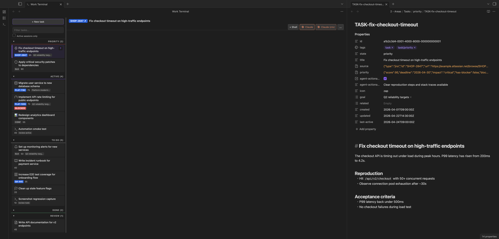
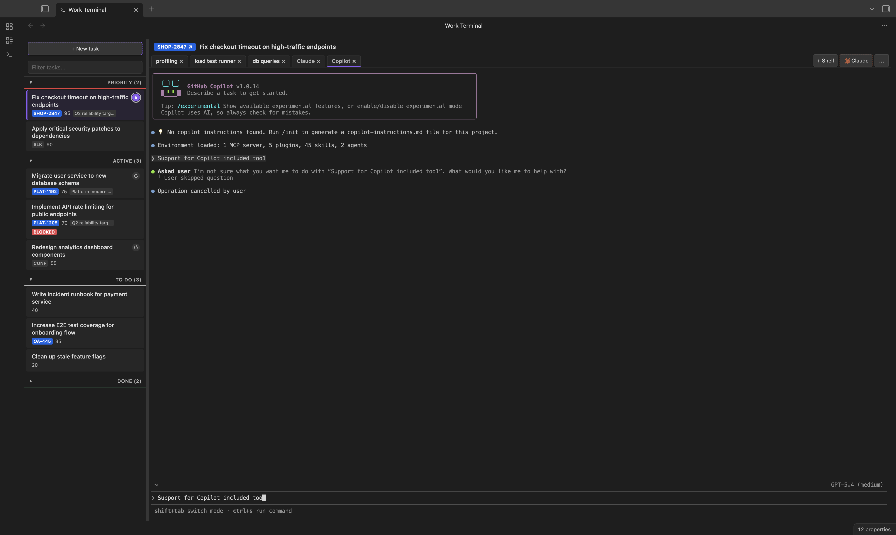
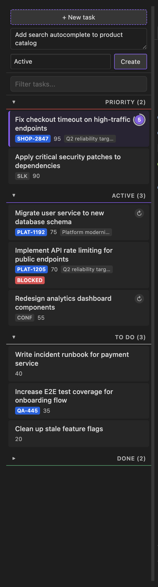
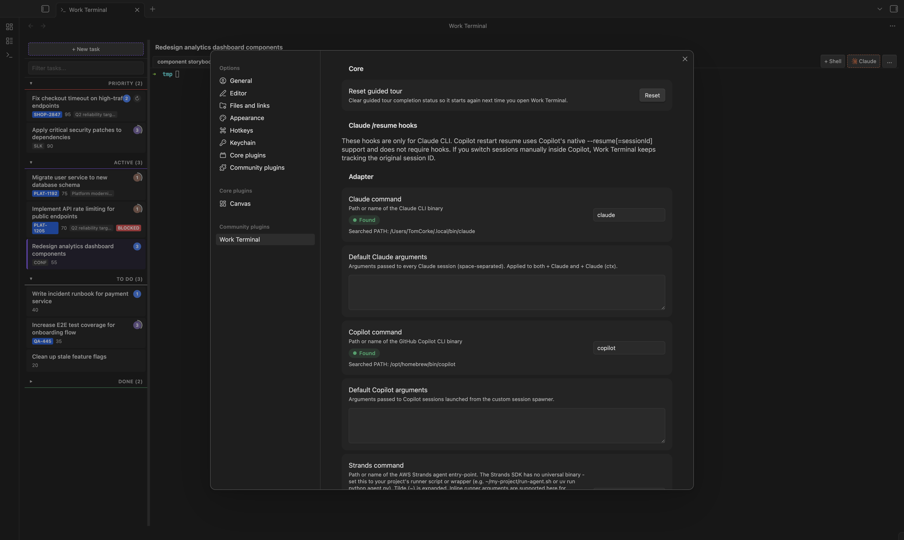

# obsidian-work-terminal

Obsidian plugin that turns your vault into a work item board with per-item tabbed terminals. Built for extensibility - swap in your own work item system while keeping the terminal infrastructure.

## Screenshots

<!-- Screenshots captured from isolated test vault with sample data -->

<table>
<tr>
<td width="50%"><br><sub>Kanban board with tabbed terminals and detail view</sub></td>
<td width="50%"><br><sub>GitHub Copilot session with activity detection</sub></td>
</tr>
<tr>
<td width="50%"><br><sub>Task creation with column selector</sub></td>
<td width="50%"><br><sub>Plugin settings and agent configuration</sub></td>
</tr>
</table>

## Features

- **Kanban board** with collapsible sections, drag-drop reordering, and custom sort order
- **Tabbed terminals** per work item - Shell, Claude, contextual Claude, and custom sessions (including GitHub Copilot CLI)
- **Agent integration** - Claude/Copilot command resolution, agent state detection (active/waiting/idle), session rename detection, headless spawning
- **Session persistence** - hot-reload preserves live terminals; disk persistence enables session resume after restart
- **First-run guided tour** - focused walkthrough for task creation, session launch, tab management, and key settings
- **Detail panel** - native Obsidian MarkdownView via workspace leaf splitting
- **Adapter architecture** - swap the work item system without touching terminal code

## Installation

Use Node.js 20.19.0 or newer (`node -v` to check), then run these commands from the directory where you want to keep the plugin source:

```bash
git clone https://github.com/tomcorke/obsidian-work-terminal.git
cd obsidian-work-terminal
pnpm install
pnpm run build
```

Then symlink this repo directory into your vault. Replace `"/path/to/your/vault"` with your vault path:

```bash
VAULT="/path/to/your/vault"
mkdir -p "$VAULT/.obsidian/plugins"
ln -s "$(pwd)" "$VAULT/.obsidian/plugins/work-terminal"
```

If `work-terminal` already exists in `.obsidian/plugins`, remove that directory or symlink first. After pulling updates, run `pnpm run build` again before reopening Obsidian. Then enable **Work Terminal** in Obsidian's **Community plugins** settings.

## Quick start

1. Enable the plugin in Obsidian's Community plugins settings
2. Open the Work Terminal view from the command palette ("Work Terminal: Open View")
3. Create a work item using the prompt box at the top of the kanban board
4. Click "+ Shell" to open a terminal tab, or "Claude" / "Claude (ctx)" for an AI agent session

## Process spawning & security

This plugin spawns external processes to provide terminal and AI agent functionality. All commands are user-configured and resolved against `$PATH`. Arguments are passed as arrays via `child_process.spawn()` (no shell interpretation). The plugin makes zero outbound network requests. Vault files are only modified through the Obsidian API, never via direct filesystem writes.

For a complete, source-verified inventory of every process spawned, every file read or written, and all security properties, see **[Process Spawning & Filesystem Disclosure](docs/process-spawning.md)**.

## Documentation

- **[User Guide](docs/user-guide.md)** - comprehensive guide covering all features with screenshots
- **[Process Spawning & Filesystem Disclosure](docs/process-spawning.md)** - full inventory of spawned processes, filesystem access, and security properties
- **[Architecture](docs/architecture.md)** - three-layer design, extension model, key design decisions
- **[Creating an Adapter](docs/creating-an-adapter.md)** - build your own work item system with code examples
- **[Development](docs/development.md)** - build, test, hot-reload, CDP helper, isolated test vault

## License

MIT
