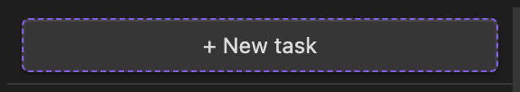
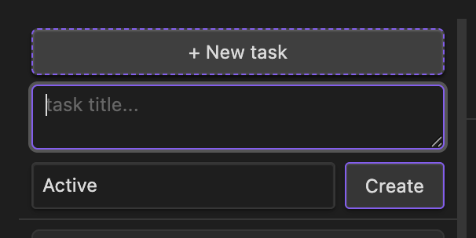
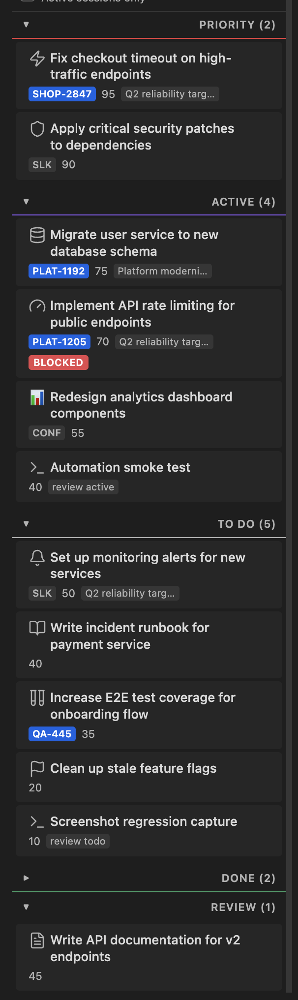
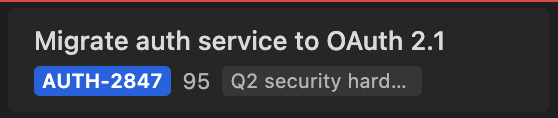
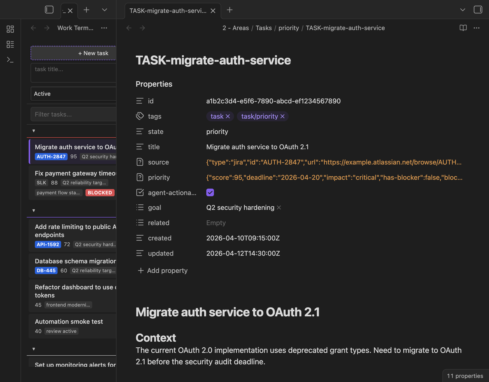
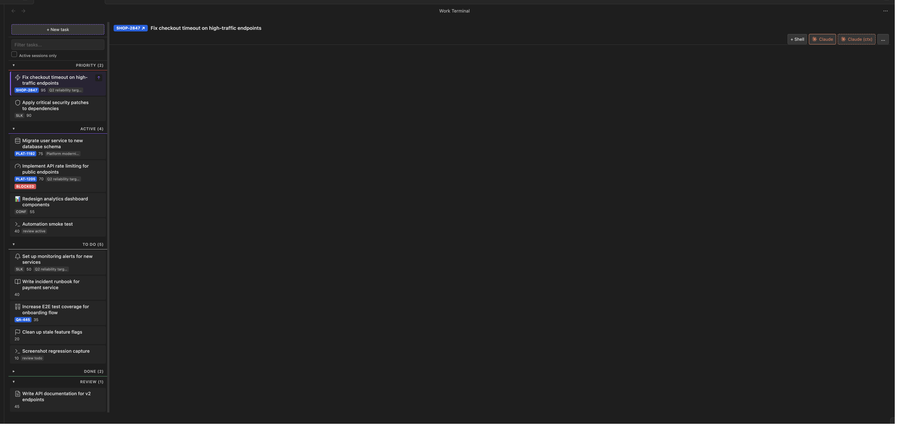
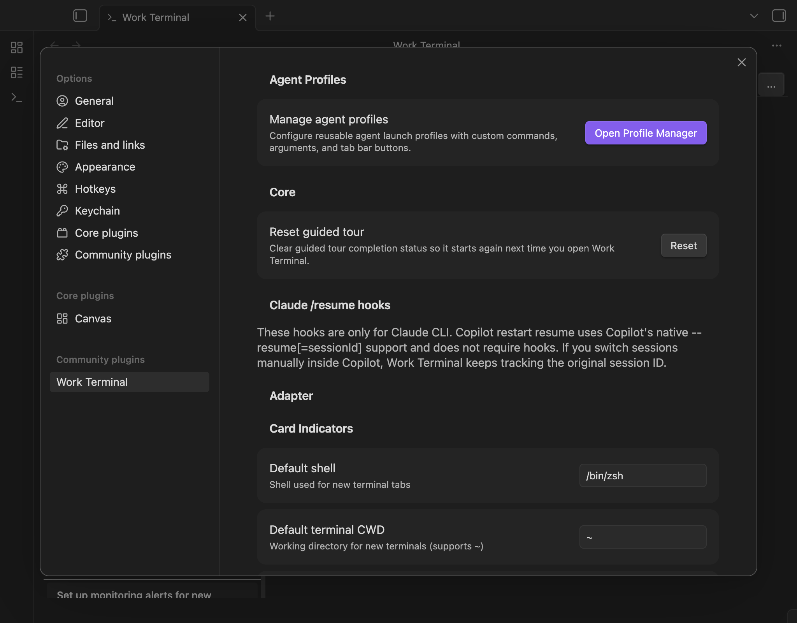

# User Guide

[Back to README](../README.md)

Work Terminal turns your Obsidian vault into a work item board with per-item tabbed terminals. This guide covers every feature in the plugin, from basic task management to advanced agent configuration.

## Table of contents

- [Overview](#overview)
- [Core workflow](#core-workflow)
  - [Creating tasks](#creating-tasks)
  - [Kanban board](#kanban-board)
  - [Task card anatomy](#task-card-anatomy)
  - [Task card icons](#task-card-icons)
  - [Card display modes](#card-display-modes)
  - [Hiding card indicators](#hiding-card-indicators)
  - [Context menu](#context-menu)
  - [Detail panel](#detail-panel)
  - [Detail view placement](#detail-view-placement)
  - [Drag-drop reordering](#drag-drop-reordering)
  - [Filtering](#filtering)
  - [Activity view](#activity-view)
- [Terminal and agent sessions](#terminal-and-agent-sessions)
  - [Shell tabs](#shell-tabs)
  - [Agent sessions](#agent-sessions)
  - [Tab management](#tab-management)
  - [Session persistence](#session-persistence)
  - [Agent state detection](#agent-state-detection)
- [Configuration](#configuration)
  - [Settings layout at a glance](#settings-layout-at-a-glance)
  - [Agent profiles](#agent-profiles)
  - [Card indicator rules](#card-indicator-rules)
  - [State resolution strategies](#state-resolution-strategies)
  - [Dynamic columns](#dynamic-columns)
  - [Terminal settings](#terminal-settings)
  - [Background enrichment](#background-enrichment)
  - [Core settings](#core-settings)
- [Advanced features](#advanced-features)
  - [Pinning tasks](#pinning-tasks)
  - [Task splitting](#task-splitting)
  - [Guided tour](#guided-tour)
  - [Debug API](#debug-api)
  - [Keyboard capture](#keyboard-capture)

---

## Overview

Work Terminal provides a two-panel layout inside Obsidian: a kanban board on the left and a tabbed terminal panel on the right. Each task on the board can have its own set of terminal sessions - shell, Claude, Copilot, or custom agent profiles.


The plugin reads task files from your vault (markdown files with YAML frontmatter) and displays them as cards in columns based on their state. Clicking a card opens a detail panel; the terminal panel provides per-task shells and AI agent sessions.

---

## Core workflow

### Creating tasks

Click the **"+ New task"** button at the top of the kanban board to expand the task creation prompt box.



When expanded, the prompt box shows a text input and a column selector:



- Type a task title in the text area
- Select which column the task should be created in (Active or To Do)
- Press **Enter** to create the task, or **Shift+Enter** to add a newline
- Click **Create** as an alternative to pressing Enter

The plugin creates a new markdown file in the appropriate vault folder with a UUID-based frontmatter structure. If background enrichment is enabled (see [Background enrichment](#background-enrichment)), a headless agent session runs automatically to flesh out the task content.

### Kanban board

The board organises tasks into collapsible columns. The default adapter provides four columns:

| Column | Description | Folder |
|--------|-------------|--------|
| **Priority** | High-priority items requiring immediate attention | `priority/` |
| **Active** | Tasks currently being worked on | `active/` |
| **To Do** | Tasks queued for future work | `todo/` |
| **Done** | Completed tasks | `archive/` |



Each column header shows the column name and the count of tasks it contains. Click a column header to collapse or expand that section.

When using the Frontmatter or Composite state strategy, additional **dynamic columns** may appear after the four built-in columns if any tasks have custom state values in their frontmatter. See [Dynamic columns](#dynamic-columns) for details.

Tasks appear as cards within their column. The order within a column can be customised using drag-drop (see [Drag-drop reordering](#drag-drop-reordering)) or the "Move to Top" context menu action.

### Task card anatomy

Each task card displays key information at a glance:



Cards contain:

- **Icon** - an optional leading icon (Lucide or emoji) when [task card icons](#task-card-icons) are enabled
- **Title** - the task name, shown prominently at the top
- **Source badge** - indicates where the task originated:
  - Jira tasks show the ticket key (e.g. `AUTH-2847`) in a blue badge that links to the Jira ticket
  - Slack tasks show `SLK`
  - Confluence tasks show `CONF`
  - CLI/prompt-created tasks show no source badge
- **Priority score** - a numeric score (0-100) with colour coding:
  - Red for high scores (60+)
  - Yellow for medium scores (30-59)
  - Grey for low scores (below 30)
- **Goal tags** - up to two goal labels shown as subtle tags
- **Card flags** - configurable indicators like the red `BLOCKED` badge (see [Card indicator rules](#card-indicator-rules))
- **Session indicator** - a small badge showing active terminal sessions for this task
- **Ingestion indicator** - shows "ingesting..." while background enrichment is running

When a task has an active terminal session, a small indicator appears on the card showing the session count and type.

### Task card icons

Task cards can display icons as a leading visual element, visible in both standard and compact display modes.

**Enabling icons**: Go to **Settings > General > Task card icons** and toggle the feature on. Icons are disabled by default.

**Custom per-task icons**: Set a custom icon for any task via:

- **Frontmatter**: Add an `icon` field to the task's YAML frontmatter with a Lucide icon name or an emoji:
  ```yaml
  icon: rocket        # Lucide icon name
  icon: "\U0001F680"          # Emoji (YAML Unicode escape)
  ```
- **Context menu**: Right-click a task card and select **Set Icon...** to open a text input modal. Enter a Lucide icon name (e.g. `rocket`, `terminal`, `flame`) or paste an emoji. Select **Clear Icon** to remove a custom icon.

**Automatic icon modes**: When a task has no custom icon, the plugin can assign icons automatically based on a configurable mode (Settings > General > Automatic icon mode):

| Mode | Description |
|------|-------------|
| **None** (default) | Only custom per-task icons are shown. Tasks without a custom icon have no icon. |
| **Source-based** | Icon reflects the task source: Jira = ticket, Slack = speech bubble, Confluence = file, CLI/prompt = terminal. |
| **State-based** | Icon reflects the kanban column: Priority = flame, Active = play, To Do = list, Done = checkmark. |

Custom per-task icons always take priority over automatic icons regardless of mode.

**Icon rendering**: Icons use Obsidian's built-in Lucide icon library (via `setIcon`). Emoji values are detected automatically and rendered as text. Unrecognised icon names are silently hidden - the card displays normally without an icon.

### Card display modes

Work Terminal offers three card display modes, configurable under **Settings > General > Card display mode**:

| Mode | Description |
|------|-------------|
| **Standard** | The default multi-line card layout with full badges, goal tags, and flag labels. |
| **Compact** | Collapses each card into a single horizontal line with indicator dots replacing verbose badges. The most dense mode - useful when you have many tasks and want to see more at once without scrolling. |
| **Comfortable** | Uses the same single-line layout as Compact (indicator dots, not full badges) but with more padding, larger gaps, and slightly bigger indicator dots. A relaxed version of Compact that trades a small amount of density for readability. |

**Compact mode** replaces the full card layout with a single row containing:

- **Title** - single line, truncated with ellipsis if it overflows
- **Indicator dots** - small coloured dots that replace the verbose meta badges:
  - Blue dot for Jira-sourced tasks (hover to see the Jira key, e.g. "CASTLE-1234")
  - Orange/red dot for priority score (hover to see the score value; red for 60+, orange for 30-59, grey for below 30)
  - Green dot for tasks with a goal assigned (hover to see the goal name)
  - Coloured dot for each active card flag (hover to see the flag label or context)
- **Session badge** - the session count badge remains visible, slightly smaller

**Comfortable mode** uses the same single-line layout as Compact - title, indicator dots, and session badge. The difference is additional breathing room: cards have more internal padding (between compact and standard), slightly larger indicator dots, and more gap between elements. This makes it easier to scan the board without switching to the full multi-line Standard layout.

The density ordering is: Compact (most dense) < Comfortable (single-line, more padding) < Standard (multi-line, full badges).

All three modes share the same interactive behaviour:

- **Drag-drop** reordering and cross-column moves
- **Selection** and detail panel opening
- **Context menu** with all the same actions
- **Agent state indicators** (active/waiting/idle border and glow animations)
- **Pinned section** with state badges (standard mode only - hidden in compact/comfortable to save space)
- **Filtering** by text and active sessions

Switch between modes at any time from the settings dropdown.

### Hiding card indicators

The **Show card indicators** setting (under **Settings > General**) controls whether metadata badges and indicator dots appear on task cards. When disabled:

- **Standard/Comfortable mode** - the metadata row below the title is hidden. This removes source badges (e.g. Jira keys), priority scores, goal tags, and card flag labels, reclaiming vertical space on the board.
- **Compact mode** - the coloured indicator dots after the title are hidden.

**What stays visible**: Agent session badges (the small session count indicators injected by the framework) remain visible regardless of this setting, since they reflect live session state rather than static metadata. Task card icons are also unaffected.

This is useful when you have many tasks and want a minimal board that shows only titles, or when the metadata is not relevant to your current workflow.

### Context menu

Right-click any task card to open the context menu with these options:

- **Move to Top** - moves the card to the top of its current column
- **Retry Enrichment** - re-runs background enrichment (shown only when enrichment previously failed)
- **Split Task** - creates a new task linked to this one and opens a Claude session to scope it
- **Move to [column]** - moves the task to a different column (Priority, Active, To Do, Done, or any dynamic columns)
- **Done & Close Sessions** - moves to Done and closes all terminal sessions for this task
- **Copy Name** - copies the task title to clipboard
- **Copy Path** - copies the vault file path to clipboard
- **Copy Context Prompt** - copies the generated context prompt for this task
- **Set Icon...** - opens a modal to set a custom icon for this task (shown when icons are enabled)
- **Clear Icon** - removes the custom icon from this task (shown when the task has a custom icon and icons are enabled)
- **Delete Task** - permanently deletes the task file (shown in red as a destructive action)

### Detail panel

Click a task card to open the detail panel. This is a native Obsidian MarkdownView that opens in a split workspace leaf alongside the Work Terminal view.



The detail panel provides:

- **Properties view** - shows all frontmatter fields (id, tags, state, title, source, priority, goals, timestamps)
- **Markdown preview** - renders the task body with full Obsidian markdown support
- **Live editing** - edit frontmatter properties or markdown content directly
- **Backlinks** - Obsidian's native backlinks panel shows other notes that reference this task

Because the detail panel is a standard Obsidian markdown view, all Obsidian features work: live preview, reading view, plugins that operate on markdown views, and the command palette.

### Detail view placement

The way the detail file is opened is configurable under **Settings > Detail view**. By default, selecting a task opens its file in a vertical split next to the Work Terminal view and applies a readable line-width override - this matches the behaviour shipped in earlier versions, so users who never open the settings see no change.

The **Placement** dropdown offers four strategies:

- **Split (default)** - create a new split beside the Work Terminal view and apply the min-width override so the editor does not squish. Best when Work Terminal sits in its own tab group.
- **Tab in active group** - open the task file as a new tab in the currently active tab group, with no splitting and no width override. Best when Work Terminal lives in a tab group alongside other files and you want the detail view to behave like any other tab.
- **Navigate active leaf** - open the task file in the most recent editor leaf that is not the Work Terminal view, falling back to a new tab if no suitable leaf exists. Does not replace the Work Terminal view itself. No new tabs or splits are created when a suitable editor leaf is already open.
- **Disabled** - do nothing on selection. Useful if you prefer to open files manually via the file explorer, quick switcher, or Obsidian's hover preview, or if you only need the terminal side of Work Terminal.

Additional options shape the behaviour:

- **Auto-close on selection change** (all placements except Disabled) - detaches the detail leaf when you select a different item, so the next selection opens a fresh leaf at the current placement target. With this off, the same leaf is reused across selections.
- **Apply readable line-width override to split** (Split only) - toggles the width override. When off, Obsidian's default flex layout controls the split and any previously-applied inline styles are cleared on the next selection.
- **Split direction** (Split only) - choose Vertical (side by side) or Horizontal (top and bottom). Vertical matches the default behaviour.

The plugin never touches leaves you opened yourself. Adopted leaves (ones Work Terminal discovered rather than created) are left in place when the selection changes; only leaves the plugin created are detached by auto-close or plugin reload.

When the placement is set to anything other than **Split**, a small document-style icon button appears at the left of the task title bar above the terminal tabs. Click it to open the current task file in a workspace leaf, using the same strategy as the **Navigate active leaf** placement (reuses the most recent non-Work-Terminal editor leaf, falling back to a new tab). The button is hidden in Split mode because the task file is already visible beside the terminal in that layout, and it updates automatically when you change the placement setting.

### Drag-drop reordering

Tasks within a column can be reordered by dragging. Grab a card and drag it to a new position within the same column. The custom sort order is persisted and survives plugin reloads.

You can also drag a task between columns to change its state. Dropping a task from "To Do" into "Active" will move the underlying file to the `active/` folder and update the frontmatter accordingly. Dropping a task into a dynamic column (one without a folder mapping) updates the frontmatter `state` field but leaves the file in its current folder.

### Filtering

The filter input at the top of the kanban board provides instant text filtering across all task titles. Type to narrow the visible cards to only those matching your search text. Clear the filter to show all tasks again.

Below the text filter is an **Active sessions only** checkbox. When enabled, only tasks that have open terminal tabs or agent sessions are shown. This is useful when working with many tasks and you want to focus on just the ones you are actively working on. The toggle combines with the text filter - both conditions must match for a card to be visible. The filter state persists across plugin reloads.

### Activity view

Work Terminal offers an alternative view mode that groups and orders tasks by recent activity instead of by state columns. This is useful when you want to see what you have been working on recently, regardless of task state.

To switch, go to **Settings > General > View mode** and select **Activity (by recency)**.

In activity mode, the kanban board is replaced with four recency sections:

| Section | Includes |
|---------|----------|
| **Recent** | Today, or the last N hours (configurable), whichever is longer |
| **Last 7 Days** | Activity within the past week |
| **Last 30 Days** | Activity within the past month |
| **Older** | Everything else, or tasks with no recorded activity |

**Activity tracking** works as follows:

- Any tab creation, agent session launch, or agent state change refreshes the activity timestamp for the associated task
- Timestamps are maintained in memory for accurate within-session ordering
- A `last-active` field is written to task frontmatter (at most once per minute) so timestamps survive plugin/Obsidian restarts
- On load, the plugin reads `last-active` from frontmatter to seed the initial ordering

**Configurable threshold**: The "Recent" section threshold can be adjusted in **Settings > General > Recent activity threshold**:

- Last hour
- Last 3 hours (default)
- Last 24 hours

The "Recent" section always includes at minimum all of today's activity, even if the threshold is shorter than the time since midnight.

**Ordering rules**: Tasks do not continuously reorder within a section based on exact timestamps. This avoids disruptive UI churn when multiple sessions are active simultaneously. Instead:

- Tasks only move between sections when they cross a section boundary (e.g. from "Recent" to "Last 7 Days")
- When a task ages out of its current section, it appears at the top of the next section
- Manual reordering within sections is supported via drag-drop and is persisted

**Drag-drop in activity mode**: Dragging a task within a section reorders it manually, just like in kanban mode. Dragging a task between sections is treated as a reorder within the destination section - it does not change the task's state or activity timestamp, since sections are time-based.

**Task states are ignored** while activity view is enabled. All tasks from every state column appear in the recency sections. This is a separate view mode, not a replacement for the state-based kanban - switch back to kanban mode at any time to see the familiar column layout.

---

## Terminal and agent sessions

The right panel provides a tabbed terminal interface. Each task can have multiple terminal sessions running simultaneously.

### Shell tabs

Click **"+ Shell"** in the tab bar to open a new shell terminal for the currently selected task.



Shell sessions:
- Use the configured default shell (defaults to your system shell, e.g. `/bin/zsh`)
- Start in the configured default working directory (defaults to `~`)
- Support full terminal emulation via xterm.js
- Handle keyboard shortcuts including Option+Arrow for word navigation, Option+B/F/D for readline, and Shift+Enter

The terminal panel is resizable - drag the divider between the kanban board and the terminal area to adjust the split.

### Agent sessions

Work Terminal integrates with AI coding agents. The built-in session types are:

- **Claude** - launches Claude CLI with standard arguments
- **Claude (ctx)** - launches Claude CLI with a context prompt that includes the task title, state, file path, and any deadline or blocker information
- **Custom profiles** - any agent configured through the profile manager (see [Agent profiles](#agent-profiles))

Agent sessions appear in the tab bar alongside shell sessions. Each tab shows the agent name and a state indicator.

The **"..."** button in the tab bar opens additional options including custom profiles and the profile launch modal, which lets you select a profile, optionally modify the launch arguments, and start the session.

### Tab management

- Click a tab to switch to that session
- The active tab is highlighted
- Hover over a tab to see the full session label
- Close a tab by clicking its close button (x) or using the keyboard shortcut
- Tabs persist across plugin hot-reloads (see [Session persistence](#session-persistence))

When a task has multiple sessions, the tab bar shows all of them. Tabs are labelled with the session type (Shell, Claude, etc.) and may be automatically renamed when agent session detection identifies a new session name.

### Session persistence

Work Terminal preserves terminal sessions across plugin hot-reloads (e.g. during development with `pnpm run dev`). All terminal sessions are stashed to a window-global store. They are fully restored on reload with their PTY state intact. This is invisible to the user - sessions just keep working.

### Agent state detection

Work Terminal monitors agent sessions and displays their current state:

- **Active** (green) - the agent is actively generating output
- **Waiting** (amber/yellow) - the agent is waiting for user input
- **Idle** (grey) - the session is idle with no recent activity

State detection works by reading the xterm buffer (not stdout), which makes it immune to status line redraws. It checks the last 6 visual lines of the terminal and handles narrow terminal wrapping via a joined-tail fallback.

The state indicator appears both on the tab and on the task card, giving you visibility into agent activity even when viewing a different tab.

---

## Configuration

Open the plugin settings via Obsidian's Settings dialog, then select **Work Terminal** under Community Plugins.



### Settings layout at a glance

The settings page is organised into five top-level sections. Use this map to jump to the right place:

| Section | What lives here |
|---------|-----------------|
| **General** | Task base path, state resolution strategy, view mode (kanban/activity), recent activity threshold, card display mode (standard/comfortable/compact), card indicator toggles, task card icons, automatic icon mode, Jira base URL, keep sessions alive, enrichment failure logs, expose debug API, reset guided tour. |
| **Board & Columns** | Column display order (reorder and pin), creation column selector, create custom state input, and **Manage Rules** for custom card flag rules. |
| **Terminal** | **Configure terminal...** button opening a dedicated dialog with default shell and default terminal CWD. |
| **Detail view** | Placement dropdown (split / tab / navigate / disabled) plus the placement-dependent auto-close toggle, readable line-width override, and split direction. |
| **Agents** | **Open Profile Manager** for agent profiles, **Configure enrichment...** for background enrichment, and **Configure agent actions...** for Split Task profile binding. |

Most groups of three or more related settings live inside a dedicated sub-dialog (Profile Manager, Background enrichment, Agent actions, Terminal) to keep the top-level page scannable. Single settings and small groups (detail view) stay inline.

The layout reorganisation itself is cosmetic: existing settings were regrouped, not renamed, so most upgrades should not change behaviour just because the settings page looks different. One exception is that `core.additionalAgentContext` was removed as a breaking change. If you are looking for a setting that used to be on the main page and cannot find it, check the nearest dialog button.

### Agent profiles

Agent profiles define reusable launch configurations for terminal sessions. Open the **Profile Manager** from the settings tab to create, edit, and manage profiles.

Each profile includes:

- **Name** - display name shown in the tab bar and launch modal
- **Agent type** - the type of agent (Claude, Copilot, Strands, or custom)
- **Command** - the executable to run (e.g. `claude`, `copilot`, `gh`)
- **Arguments** - command-line arguments passed to the agent
- **Default CWD** - working directory for the session (supports `~` expansion)
- **Tab bar button** - optionally add a quick-launch button to the tab bar
- **Context prompt** - a prompt template injected when launching with task context

The per-profile **Context prompt** field is the place to configure additional context that used to live in the removed **Additional agent context prompt** setting (issue #472). Set it on each profile that should inject task context on top of the adapter prompt.

**Placeholders**: The **Arguments** and **Context prompt** fields support placeholder variables that expand to work item data at launch time:

| Placeholder | Description |
|-------------|-------------|
| `$title` | Work item title |
| `$state` | Work item state (e.g. "priority", "active") |
| `$filePath` | Vault-relative file path |
| `$absoluteFilePath` | Fully resolved absolute filesystem path (useful for agents that need to read files directly) |
| `$id` | Work item UUID |
| `$sessionId` | Agent session ID (assigned at launch) |
| `$workTerminalPrompt` | The fully assembled context prompt (only meaningful in arguments, not in the context template itself) |

For example, an argument string like `--file $absoluteFilePath --task $title` would expand to something like `--file /Users/me/vault/Tasks/active/my-task.md --task My Task`.

**Import/Export**: Profiles can be exported as JSON for sharing or backup, and imported from JSON to quickly set up a new installation.

**Last-Claude-profile deletion guard**: The Profile Manager prevents deleting a Claude-family profile when doing so would leave zero Claude profiles. This keeps the fallback chain for **Split Task** and **Retry Enrichment** intact - both actions launch Claude specifically, so at least one Claude profile must exist. The **Delete** button on the edit modal is greyed out with a tooltip explaining that at least one Claude profile must remain for **Split Task** and **Retry Enrichment** in that situation. Non-Claude profiles (shell, Copilot, Strands, custom) are never counted towards the minimum and can always be deleted. Built-in `default-claude` and `default-claude-ctx` profiles are not specially protected - either can be deleted as long as another Claude profile remains.

### Card indicator rules

Card indicator rules let you define custom visual flags that appear on task cards based on frontmatter field values.

The default rule creates a red **BLOCKED** badge when `priority.has-blocker` is `true`. You can add custom rules from the settings tab under **Card Indicators** by clicking **Manage Rules**.

Each rule specifies:

- **Field** - the frontmatter field path to check (supports dot notation, e.g. `priority.has-blocker`)
- **Value** - the value to match (supports booleans, strings, and numbers)
- **Label** - text shown on the badge
- **Style** - the visual treatment:
  - `badge` - a coloured inline badge in the card's meta row
  - `accent-border` - a coloured left border on the card plus a label
  - `background-tint` - a subtle background colour on the entire card plus a label
- **Colour** - the CSS colour used for the flag
- **Tooltip** - hover text; supports `{{field.path}}` template syntax to show dynamic values

### State resolution strategies

The adapter determines task state (which column a task appears in) using one of three strategies, configured under **Adapter > State resolution strategy**:

| Strategy | Description |
|----------|-------------|
| **Folder** (default) | State is derived from which folder the task file lives in. Moving a file to `active/` makes it an active task. Only the predefined states (priority, active, todo, done, abandoned) are supported. |
| **Frontmatter** | State is read from the `state` frontmatter field. Any string value is valid - custom states create dynamic columns. Falls back to folder location if the field is missing. |
| **Composite** | Checks frontmatter first, falls back to folder. Any frontmatter value is valid. On state transitions, both frontmatter and folder are updated for known states; dynamic states update frontmatter only. |

For most users, the default folder strategy works well. Use frontmatter or composite if you need tasks to retain their state independently of folder structure, or if you want to use custom states.

### Dynamic columns

When using the **Frontmatter** or **Composite** state strategy, you can set the `state` frontmatter field to any value - not just the predefined columns. For example, setting `state: review` or `state: blocked-upstream` in a task's frontmatter will create a new column on the kanban board for that state.

Dynamic columns:

- **Appear automatically** when any task has a state not in the predefined column list
- **Initially appear after** the configured columns (Priority, Active, To Do, Done) until you reorder them
- **Can be reordered** using the column display order controls in settings, just like built-in columns. Once reordered, the dynamic column's position is persisted.
- **Are shown with a star** (\*) in the settings column ordering UI to distinguish them from built-in columns
- **Do not have folder mappings** - dragging a task into a dynamic column updates its frontmatter `state` field but does not move the file to a different folder
- **Auto-cleanup** - empty dynamic columns are automatically removed from the board and column order settings when no tasks remain in them, unless they are pinned (see below)

This is useful for workflows that need temporary or project-specific states like "review", "waiting", "testing", or any other status that makes sense for your work.

#### Pinning custom states

Dynamic columns can be **pinned** to keep them visible on the board even when they have no tasks. This is useful for permanent workflow stages that should always appear regardless of whether tasks currently occupy them.

To pin a dynamic column, go to **Settings > Board & Columns** and click the **Pin** button next to the dynamic column's entry in the column order list. Pinned columns show "(pinned)" next to their label. Click **Unpin** to allow the column to auto-clean when empty.

Resetting the column order to defaults also clears all pinned custom states.

#### Creating custom states from settings

You can pre-create a custom state column without needing to first create a task with that state. In **Settings > Board & Columns**, use the **Create custom state** input at the bottom of the column order section.

Type a lowercase identifier with hyphens (e.g. `review`, `blocked-upstream`, `testing`) and press Enter. The new column is added to the column order and pinned by default so it stays visible even with zero tasks. You can then drag tasks into the new column or set the `state` frontmatter field to match the column ID.

### Terminal settings

Terminal-launch configuration lives in a dedicated dialog opened by the **Configure terminal...** button under **Settings > Terminal**. The dialog currently exposes:

- **Default shell** - shell used for new terminal tabs. Defaults to `$SHELL` at plugin load time (typically `/bin/zsh` on macOS).
- **Default terminal CWD** - working directory for new terminal tabs. Supports `~`, which expands to your home directory.

Existing tabs keep whatever shell and CWD they were opened with - changing these settings only affects terminals opened after the change. The dialog persists changes as you type; close it with **Done** when finished.

### Background enrichment

When enabled, new tasks created via the prompt box are automatically enriched by a headless agent session. The agent reads the task file and adds context, acceptance criteria, and other useful content.

All enrichment options live in a dedicated dialog opened by the **Configure enrichment...** button under **Settings > Agents**.

The dialog contains:

- **Enable background enrichment** - toggle on/off
- **Enrichment prompt** - custom prompt template sent to the agent. Use `$filePath` (vault-relative path, e.g. `2 - Areas/Tasks/todo/my-task.md`) or `$absoluteFilePath` (absolute filesystem path, e.g. `/Users/you/vault/2 - Areas/Tasks/todo/my-task.md`) as placeholders for the task file path. The built-in default uses `$absoluteFilePath` because the agent typically needs to `cd` into the folder and read the file directly. Leave blank to use the built-in default; the full default prompt is shown in a collapsible "View default prompt" block below the textarea so you can read it before deciding whether to override.
- **Retry enrichment prompt** - separate prompt used when retrying via the context menu. Same placeholders and default-preview treatment as the enrichment prompt.
- **Enrichment agent profile** - which agent profile to use (defaults to core Claude settings)
- **Retry enrichment profile** - which agent profile to launch for the **Retry Enrichment** context-menu action. Lists Claude-family profiles only. Default: reuse the background enrichment profile above if it is set to a Claude-family profile; if the background enrichment profile is unset or is a non-Claude profile, it is ignored and Retry Enrichment falls back to the built-in Claude (ctx) profile.
- **Enrichment timeout** - maximum time in seconds before the enrichment process is killed (default: 300s / 5 minutes)
- **Preview resolved prompt** - pick either prompt and click **Preview** to see the template with placeholders substituted using example paths (`$filePath` -> `2 - Areas/Tasks/todo/example.md`, `$absoluteFilePath` -> `/Users/you/vault/2 - Areas/Tasks/todo/example.md`). Useful for sanity-checking a customised prompt without creating a real task. The paths shown are illustrative; the actual paths used at launch time are derived from your real vault location and the created task file.

Changes save as you type; there is no Save button. Close the dialog with **Done** when you are finished.

Tasks being enriched show an "ingesting..." indicator on their card. If enrichment fails, a red "enrichment failed" badge appears, and the context menu offers a "Retry Enrichment" option.

#### Enrichment failure logs

When an enrichment attempt fails, the plugin writes a diagnostic log file so you can see what went wrong without attaching a debugger or reproducing the failure. Logs are stored in the plugin directory at:

```
<vault>/<configDir>/plugins/work-terminal/logs/enrich-<YYYYMMDD-HHMMSS-sss>-<slug>-<rand>.log
```

`<configDir>` is whatever Obsidian is configured to use for its config directory, and is `.obsidian` by default - so on most vaults the path will be `<vault>/.obsidian/plugins/work-terminal/logs/...`.

Each log records:

- Timestamp, item UUID, and the task file path at the time of failure
- A failure category: `timeout`, `non-zero-exit`, `silent-failure`, `moved-during-enrichment`, `pending-not-renamed`, `spawn-error`, or `missing-cli`
- The full enrichment prompt that was sent to the agent
- Raw stdout and stderr captured from the agent process
- Exit code when applicable, plus an adapter-validation note (e.g. "pending file still exists on disk after exit 0")
- JS error message and stack trace when the spawn/promise rejected
- Agent command, arguments, working directory, and configured timeout

**Retention**: on every failure the pruner removes logs older than 7 days AND caps the total at 50 files. You should not need to clean the directory manually.

**Toggle**: the **Enrichment failure logs** checkbox under **Settings > General** enables or disables the feature (default: enabled). Disabling it stops new logs being written; existing files on disk are not removed retroactively - delete the `logs/` folder by hand if you want to purge the history immediately.

**Sensitive content warning**: log files include the full enrichment prompt and the raw agent output. If your prompt template or task content references sensitive data (API keys, internal URLs, personal notes) those values will also appear in the log. Treat the `logs/` directory as you would any other local debug dump, and share logs only with people you are comfortable reading that content.

### Core settings

The **General** section covers board-wide preferences and utility toggles. The most commonly-used items:

| Setting | Description |
|---------|-------------|
| **Task base path** | Vault path containing task folders (adapter setting, shown first because it is typically set once at install time). |
| **State resolution strategy** | How task state is determined: folder (default), frontmatter, or composite. See [State resolution strategies](#state-resolution-strategies). |
| **View mode** | Choose between **Kanban** (group by state columns) and **Activity** (group by recency). See [Activity view](#activity-view). |
| **Recent activity threshold** | How far back the "Recent" section extends in activity view: Last hour, Last 3 hours (default), or Last 24 hours. |
| **Card display mode** | Choose between **Standard** (full multi-line card details), **Compact** (single-line cards with indicator dots), and **Comfortable** (single-line like Compact but with more padding). See [Card display modes](#card-display-modes). |
| **Show card indicators** | Whether metadata badges and indicator dots appear on task cards. See [Hiding card indicators](#hiding-card-indicators). |
| **Task card icons** | Whether icons are shown on task cards at all. See [Task card icons](#task-card-icons). |
| **Automatic icon mode** | Which automatic icon scheme to apply when a task has no custom icon (none, source-based, state-based). |
| **Jira base URL** | Browse URL prefix used to turn Jira keys like `AUTH-2847` into clickable external links. |
| **Keep sessions alive** | When enabled, closing the Work Terminal tab stashes sessions to memory instead of killing them. Reopening restores sessions with full PTY state. |
| **Enrichment failure logs** | When enabled, each failed background enrichment writes a diagnostic log file to `<configDir>/plugins/work-terminal/logs/` (usually `.obsidian/plugins/work-terminal/logs/`). See [Enrichment failure logs](#enrichment-failure-logs). |
| **Expose debug API** | Publishes `window.__workTerminalDebug` for CDP inspection (see [Debug API](#debug-api)). |
| **Reset guided tour** | Clears the guided tour completion status so it starts again on next open. |

**Default shell** and **Default terminal CWD** moved into the [Terminal settings](#terminal-settings) dialog in the #462 reorganisation. Their setting keys (`core.defaultShell`, `core.defaultTerminalCwd`) are unchanged.

---

## Advanced features

### Pinning tasks

Pin important tasks to keep them visible at the top of the board regardless of their column. Pinned tasks appear in a dedicated **Pinned** section above the regular columns.

To pin a task, use the pin action from the task's context area. Pinned tasks can be reordered within the pinned section using drag-drop. Unpin a task to return it to its normal column position.

In **standard mode**, pinned cards show a state label badge (e.g. "Active", "To Do") so you can see each task's real column at a glance. In **compact** and **comfortable** modes, the state label is hidden to conserve horizontal space - the dedicated Pinned section heading already provides sufficient context.

Pinned state is persisted across sessions using the task's UUID, so it survives file renames and moves.

### Task splitting

Split a complex task into smaller pieces using the **Split Task** context menu option. This:

1. Creates a new task file with a reference back to the original task
2. Places the new task in the specified column
3. Launches a Claude session scoped to the new sub-task

The split task includes metadata linking it to the parent task, making it easy to trace the relationship.

The Claude session launched by Split Task runs through the same agent-profile pipeline as the **Claude (ctx)** tab bar button. This means the session inherits your configured command, arguments, login-shell wrapping, and any custom profile flags (e.g. `--dangerously-skip-permissions`, `--allowedTools`, `--model`). The working directory defaults to the **parent folder of the new task file**, so relative paths mentioned in the split scope prompt resolve against the task's own location. To override the profile for Split Task specifically, see [Agent actions settings](#agent-actions-settings).

### Retry enrichment

When background enrichment for a newly created task fails, the card shows a warning and a **Retry Enrichment** context menu entry. Running it opens a Claude session that picks up where background enrichment left off.

The retry session also runs through a resolvable agent profile. By default it follows the **background enrichment profile** (so the retry matches what automated enrichment would have used) when that profile is Claude-family; if the background enrichment profile is unset or is a non-Claude profile, it falls back to the built-in Claude (ctx) profile. You can override this to any Claude-family profile via the **Retry enrichment profile** dropdown in the [Background enrichment](#background-enrichment) **Configure enrichment...** dialog.

### Agent actions settings

Profile binding for the **Split Task** adapter-driven action lives behind the **Configure agent actions...** button under **Settings > Agents**. The dialog exposes one dropdown:

- **Split task profile** - which agent profile to launch for Split Task. Default: the built-in Claude (ctx) profile.

The dropdown lists configured Claude-family agent profiles only. Select **Default (see description)** to restore the fallback chain described above. Changes persist immediately; no save button is required.

The **Retry Enrichment** profile binding lives in the [Background enrichment](#background-enrichment) dialog instead, so all enrichment-related settings (prompts, profile, retry profile, timeout) are configurable in one place.

The fallback chain ensures new users get sensible, profile-aware behaviour without touching the dialog, while power users can bind a dedicated profile (e.g. one with `--dangerously-skip-permissions` pre-configured) to any agent-driven action.

### Guided tour

When you first open Work Terminal, a guided tour walks you through the key features:

- Task creation via the prompt box
- Launching terminal sessions
- Tab management
- Important settings

The tour highlights each feature area with a tooltip and explanation. You can dismiss the tour at any point, and reset it from Settings > **Reset guided tour** to run it again.

### Debug API

When **Expose debug API** is enabled in settings, Work Terminal publishes a debug interface at `window.__workTerminalDebug`. This is useful for:

- Automated testing via CDP
- Inspecting plugin state without opening DevTools
- Building automation scripts

The API exposes session metadata, task state, and terminal references. It is disabled by default because it makes active session metadata visible to other renderer plugins.

### Keyboard capture

When a terminal tab is focused, Work Terminal captures keyboard input to prevent Obsidian's hotkeys from interfering with terminal interaction. The capture handles:

- **Option+Arrow** keys for word-by-word navigation
- **Option+B/F/D** for readline-style movement and deletion
- **Shift+Enter** for sending literal newlines
- **Option+Backspace** for deleting the previous word
- **Cmd+Left/Right** for home/end navigation
- **Option+digit** combos are preserved for layout-specific characters (accented letters, symbols)

Two capture layers operate together: a bubble-phase handler and a capture-phase handler that intercepts keys before Obsidian processes them. xterm.js retains its default Meta key behaviour.

When a terminal is not focused, all keyboard shortcuts revert to normal Obsidian behaviour.

---

## Frontmatter reference

Task files use YAML frontmatter with this structure:

```yaml
---
id: <uuid>                    # Unique identifier (survives renames)
tags:
  - task
  - task/<state>              # State tag for Obsidian queries
state: <state>                # priority | active | todo | done | abandoned | <any custom value>
title: "<title>"              # Task display name
source:
  type: prompt|slack|jira|confluence|other # Where the task originated
  id: "<id>"                  # Source-specific identifier
  url: "<url>"                # Link back to source
  captured: <iso-date>        # When the task was captured
priority:
  score: <0-100>              # Numeric priority score
  deadline: "<date>"          # Optional deadline
  impact: critical|high|medium|low # Impact assessment
  has-blocker: true|false     # Whether the task is blocked
  blocker-context: "<text>"   # Description of the blocker
agent-actionable: true|false  # Whether an agent can work on this
icon: "<name-or-emoji>"       # Custom card icon (Lucide name or emoji)
goal: []                      # Associated goals
related: []                   # Related task references
created: <iso-date>
updated: <iso-date>
---
```

### Folder structure

Tasks live under a configurable base path (default: `2 - Areas/Tasks/`) with sub-folders for each state:

```
2 - Areas/Tasks/
  priority/    # High-priority tasks
  active/      # Tasks being worked on
  todo/        # Queued tasks
  archive/     # Completed tasks
```

The `abandoned` state is a special terminal state - abandoned tasks are filtered from the board display.

---

## Adapter settings reference

These settings are specific to the task-agent adapter. Adapter-level fields now appear across the new top-level sections (see [Settings layout at a glance](#settings-layout-at-a-glance)) - mostly under **General** and **Board & Columns** - rather than in a single **Adapter** block. Background-enrichment fields are edited inside the **Configure enrichment...** dialog (opened from the **Agents** section) and are marked below.

| Setting | Description | Default |
|---------|-------------|---------|
| Task base path | Vault path containing task folders | `2 - Areas/Tasks` |
| State resolution strategy | How task state is determined (folder/frontmatter/composite) | `folder` |
| Jira base URL | URL prefix for turning Jira keys into links (e.g. `https://your-org.atlassian.net/browse`) | (empty) |
| Enable background enrichment | Auto-enrich new tasks via headless agent (edited via **Configure enrichment...**) | `true` |
| Enrichment prompt | Custom prompt template for enrichment (edited via **Configure enrichment...**) | (default) |
| Retry enrichment prompt | Custom prompt for retry enrichment (edited via **Configure enrichment...**) | (default) |
| Enrichment agent profile | Which profile to use for enrichment (edited via **Configure enrichment...**) | Default |
| Retry enrichment profile | Which profile to use when running Retry Enrichment from the card context menu (edited via **Configure enrichment...**) | Default |
| Enrichment timeout | Max seconds for enrichment (edited via **Configure enrichment...**) | 300 |
| Show card indicators | Show metadata indicators on cards (source badges, priority scores, goal tags, card flags, indicator dots). See [Hiding card indicators](#hiding-card-indicators). | `true` |
| Task card icons | Show icons on task cards | `false` |
| Automatic icon mode | How automatic icons are assigned (none/source/state) | `none` |

---

## Tips

- **Jira integration**: Set the Jira base URL in adapter settings to make Jira ticket badges (e.g. `AUTH-2847`) clickable links that open in your browser.
- **Multiple agents**: Create separate profiles for different agent configurations - one for code review, another for implementation, a third for documentation.
- **Quick triage**: Use the Priority column for items needing immediate attention. The score badge gives a visual ranking.
- **Blocker visibility**: The default BLOCKED flag rule makes blockers immediately visible. Add custom rules for other states you want to track (e.g. "waiting for review", "needs design input").
- **Keyboard workflow**: Use the filter input to quickly find tasks, then click to select and use keyboard shortcuts in the terminal.
